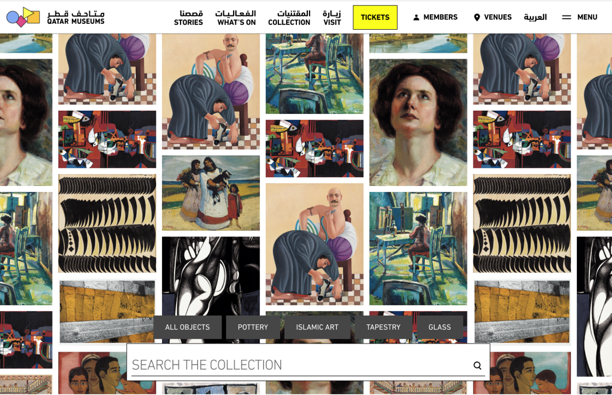
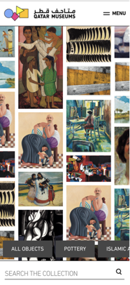

# The Client - Website

## Inhoudsopgave Readme

  * [Beschrijving](#beschrijving)
  * [Kenmerken](#kenmerken)
  * [Licentie](#licentie)

## Beschrijving
<!-- In de Beschrijving staat hoe je project er uit ziet, hoe het werkt en wat je er mee kan. -->

Om de collectie weer te geven, heeft Qatar Museums een nieuwe pagina nodig. Met behulp van filters en een zoekbalk kunnen gebruikers kunstwerken zoeken en meer informatie vinden.
De pagina is responsive en is mobile first gemaakt.
<!-- Voeg een mooie poster visual toe 📸 -->
<!-- Voeg een link toe naar Github Pages 🌐-->
https://irisvw.github.io/the-client-website/

## Kenmerken
<!-- Bij Kenmerken staat welke technieken zijn gebruikt en hoe. Wat is de HTML structuur? Wat zijn de belangrijkste dingen in CSS? Wat is er met Javascript gedaan en hoe? Misschien heb je een framwork of library gebruikt? -->
- Responsive
- Accessible
- Multilingual
- API driven
- Filterable (on hover)

---
https://github.com/fdnd-agency/fabrique/tree/design-challenge

## Design challenge
Design and develop new features for the Qatar Museums Online Collection website.

There are a few features that we would like to see if you can design and develop. The design has a homepage with a so
called infinite canvas where users can scroll to in all directions (vertical and horizontal). The canvas is filled with
the objects from the API (randomized on load) and are repeated randomly on the canvas. The objects are clickable and when clicked they open 
a detail page of this object (out of scope for this challenge). 

The landingpage has filters, which on hover 'dim' objects that are not applicable to that filter. The filters are 
clickable as well, and lead the user to the search page (not in scope).

This page needs to be SEO friendly, accessible (keyboard navigation) and responsive (work on mobile and tablet as well).
If you can make it perform well, that would be a big plus.
To top it off, this pages is also multilingual (English and Arabic). Which means you need to accomodate for RTL text 
direction as well.

Progressive enhancement is allowed (e.g. slightly different behaviour on mobile or older browsers) but it should 
work in any major desktop browser.

### Features

- API driven
- Responsive
- SEO friendly
- Accessible (WCAG AA)
- Multilingual (LTR & RTL)
- Performant
- Randomized objects on load
- Zoomable (200% in, 50% out)
- Pannable (hence infinite)
- Filterable (on hover)

### Good to mention

- Infinite canvas logic, think it through before starting
- Fonts are ffa (use any Latin and Arabic font)
- Navigation can be hardcoded (EN / AR)
- Hamburger (menu overlay) can be dismissed
- Search is just a field, no endpoint

## Bronnen
Fonts:
- [IBM Plex Sans](https://fonts.google.com/specimen/IBM+Plex+Sans)
- [Cairo](https://fonts.google.com/specimen/Cairo)

## Licentie

This project is licensed under the terms of the [MIT license](./LICENSE).
